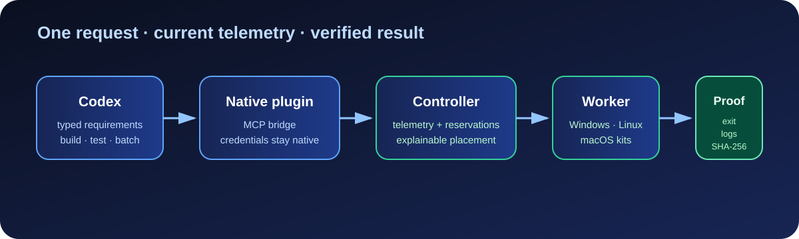
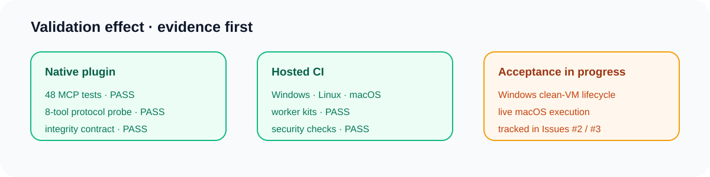

# ClusterYourCodex

> **Give Codex more computers.**

ClusterYourCodex is a Codex-first controller and worker fleet for distributing builds, tests, batch jobs, containers, and GPU work across computers you own. The Controller chooses a compatible worker from current telemetry and reservations, then returns verified logs and artifact hashes to the Codex session.

[](https://github.com/TypeThe0ry/ClusterYourCodex/releases) [](https://github.com/TypeThe0ry/ClusterYourCodex/releases) [](https://github.com/TypeThe0ry/ClusterYourCodex/actions) [](LICENSE)



> **Repository snapshot:** `main` contains the published `v0.0.1` stable line;
> current fixes are delivered as prerelease candidates until their acceptance
> evidence is complete. The published `v0.0.1` tag and assets are immutable.

## Start here

| Goal | Action |
| --- | --- |
| Use the published baseline | Install [`v0.0.1`](https://github.com/TypeThe0ry/ClusterYourCodex/releases/tag/v0.0.1) |
| Use the current Codex integration fix | Use the [source-checkout repair](#codex-plugin-integrity); the published preview predates this fix |
| Recover a broken native plugin | Run the [one-command repair](#codex-plugin-integrity) below |
| Verify a checkout | Run the [native plugin checks](#native-plugin-checks) |

## Status at a glance



### What the test effect means

The green cards above are backed by repeatable checks, not a decorative claim:

- **Native plugin:** the integrity contract, bundled runtime, MCP protocol probe, and 48-test MCP suite pass on the Windows controller host. See the [cache verification record](docs/native-plugin-cache-verification-20260919.md).
- **Hosted CI:** the current candidate exercises Rust on Windows/Linux/macOS, native Linux/macOS Worker Kits, dependency/security checks, and the Windows controller/bridge path. See [GitHub Actions](https://github.com/TypeThe0ry/ClusterYourCodex/actions) for the run history.
- **Acceptance in progress:** the original Windows 11 ISO matches Microsoft's published hash. A disposable D-drive VMware VM reached Windows boot code using a modified, no-prompt test ISO; Setup and the clean-VM install/repair/rollback lifecycle remain unverified. The VM was stopped after testing. The macOS managed-runtime gate remains tracked in [Issue #3](https://github.com/TypeThe0ry/ClusterYourCodex/issues/3).

This distinction keeps the README useful: a passing package test proves the package contract, while a clean-VM or live-worker claim requires the corresponding runtime evidence.

### Recorded candidate test results

#### Current repository audit — 2026-09-22

The audited implementation baseline is `e3f1589` (PR #116). Its completed candidate CI run
[`35716663556`](https://github.com/TypeThe0ry/ClusterYourCodex/actions/runs/35716663556)
passed every required job: Windows/Linux/macOS Rust, MSRV, native Linux and
macOS Worker Kits, the Windows install lifecycle, managed worker-kit lifecycle,
and the Windows controller/worker live round trip. CodeQL and dependency
security checks also passed.

The current PR disposition is complete for applicable work: #112 (runtime
dependencies), #114 (documentation audit), #115 (recovered Vitest 5 update),
and #116 (worker-kit lifecycle budget) are merged. The #116 fix gives the
sequential Windows-hosted worker-kit fixtures a 40-minute step budget while
retaining bounded per-fixture watchdogs.

The stable `v0.0.1` tag and assets remain unchanged at
`e4fbaef04b764268fa038311d85573b18b549f9f`. Issues [#2](https://github.com/TypeThe0ry/ClusterYourCodex/issues/2)
and [#3](https://github.com/TypeThe0ry/ClusterYourCodex/issues/3) remain open
because hosted CI is not a substitute for a clean Windows 11 VM lifecycle or
a live macOS LaunchAgent and managed controller/worker round trip.

The table below summarizes that tested baseline and the separately recorded
VM experiment; it is not a live status feed for later commits.

| Test layer | Current result | What was observed |
| --- | --- | --- |
| Rust controller/workspace | PASS | Windows, Ubuntu, and macOS jobs completed successfully |
| Native Worker Kits | PASS | Linux x64 plus macOS x64/arm64 package checks completed |
| Security and dependency gates | PASS | CodeQL, RustSec, Cargo deny, and pnpm audit completed |
| Windows controller/bridge job | PASS | The current candidate run completed the Windows controller/worker live round trip |
| D-drive VMware acceptance | BOOTSTRAP ONLY | The no-prompt test ISO reached Windows boot code after earlier EFI CD-ROM timeouts; Setup and the application lifecycle remain unverified. See the [CLI experiment record](docs/vmware-acceptance-20260920.md) |

The diagrams summarize the evidence categories; they are not application screenshots or an automatically refreshed test dashboard. Runtime acceptance remains open until the corresponding evidence is recorded.

| Area | State | Evidence |
| --- | --- | --- |
| Native Codex plugin | Ready | Registration, bundled runtime integrity, and MCP 8-tool smoke pass on Windows |
| Windows controller/worker | Preview-ready | Hosted CI controller/worker round-trip is green; clean-VM GA evidence remains open |
| Linux worker kit | Preview-ready | Native Linux kit build and contract verification pass |
| macOS worker kits | Package-ready | Intel and Apple Silicon kits build and verify; live managed execution remains gated |
| Stable release | `v0.0.1` unchanged | New work stays prerelease until the real GA gates in Issues [#2](https://github.com/TypeThe0ry/ClusterYourCodex/issues/2) and [#3](https://github.com/TypeThe0ry/ClusterYourCodex/issues/3) are evidenced |

### Choose the right channel

| You need | Use | What it means |
| --- | --- | --- |
| A published baseline | [`v0.0.1`](https://github.com/TypeThe0ry/ClusterYourCodex/releases/tag/v0.0.1) | Immutable stable assets; no native-plugin recovery fixes |
| A published preview | [v0.1.0-preview.102](https://github.com/TypeThe0ry/ClusterYourCodex/releases/tag/v0.1.0-preview.102) | Latest published preview as of 2026-09-19; predates the native-plugin repair below |
| Source development | `main` or a feature branch | Run the checks below before packaging; do not call a preview stable |

For installation fixes and their verification, see the
[native plugin recovery record](docs/native-plugin-recovery-20260918.md).
For current acceptance gaps, see [project status](docs/project-status.md).

## What you get

- **One Windows-first desktop flow:** add a computer, connect Codex, run a check.
- **Typed scheduling:** requirements are filtered against capabilities; current load and reservations decide the best eligible worker.
- **Evidence by default:** every run records placement, native exit status, logs, cleanup state, and artifact SHA-256 values.
- **Portable workers:** Linux and macOS Worker Kits share the same protocol; managed runtime support remains platform-gated.
- **Credential boundaries:** passwords, keys, and bearer tokens stay behind native vault/config references and never enter JobSpec payloads or Codex calls.

## The shortest useful mental model

```text
Codex session
    -> native ClusterYourCodex plugin + MCP bridge
    -> local Controller (typed requirements, reservations, receipts)
    -> Windows / Linux / macOS Worker
    -> exit status + logs + SHA-256 artifact evidence
```

The Controller owns placement. The model supplies requirements and consumes
verified results; it does not pick a worker from a stale snapshot or receive
worker credentials.

## Current release

**Stable: [v0.0.1](https://github.com/TypeThe0ry/ClusterYourCodex/releases/tag/v0.0.1)**

Download [Windows Setup](https://github.com/TypeThe0ry/ClusterYourCodex/releases/download/v0.0.1/ClusterYourCodex-Setup.exe) and its [SHA-256 sidecar](https://github.com/TypeThe0ry/ClusterYourCodex/releases/download/v0.0.1/ClusterYourCodex-Setup.exe.sha256). The release includes the Windows desktop/controller, Codex plugin, self-contained ZIP, Linux/macOS Worker Kits, SBOM, checksums, and provenance.

Windows binaries are currently code-unsigned; verify the sidecar before running Setup. The supported execution boundary is trusted, single-user workloads. Hostile-workload isolation is outside the current product scope; see the decision in [Issue #5](https://github.com/TypeThe0ry/ClusterYourCodex/issues/5). Closing that proposal does not enable the isolated tier.

### Codex plugin integrity

The current Windows installer and integration-preview pipeline ship the native
`cluster-your-codex@clusteryourcodex` plugin with its private Node runtime. The
installer validates the manifest, MCP bridge, runtime, marketplace binding, and
file hashes before registering the plugin. The recovery fixes are in the
repository, not the published `v0.0.1` or `v0.1.0-preview.102` assets. As of
2026-09-19, installing the latest published preview is not a verified remedy
for this error. Use the source-checkout repair below until an installer built
from the corrected source is published; do not copy a plugin directory from a
different build.

For a source-checkout recovery, use an up-to-date checkout with the documented
development dependencies installed and run from its root. This path requires
build tools; it is not the dependency-free Setup experience. Use the native
Codex CLI registration path. Keep
the generated marketplace under a persistent Codex-owned directory; a temporary
marketplace can be deleted by cleanup jobs and make an otherwise healthy plugin
look missing on the next launch:

```powershell
$marketplace = Join-Path $env:USERPROFILE '.codex/marketplaces/clusteryourcodex'
powershell -ExecutionPolicy Bypass -File scripts/Install-NativeCodexPlugin.ps1 `
  -MarketplaceRoot $marketplace
```

If that directory was left empty or partial by an interrupted install, the
installer automatically moves it to a timestamped recoverable backup,
rebuilds the native payload, and runs the integrity and MCP probes. Pass
`-Repair` when you also want to force-rebuild an otherwise complete directory
(for example after an interrupted upgrade):

```powershell
powershell -ExecutionPolicy Bypass -File scripts/Install-NativeCodexPlugin.ps1 `
  -MarketplaceRoot $marketplace -Repair
```

The recovery path uses the bundled MCP runtime and does not install or depend
on legacy `clustor`, `cluster-orchestrator`, or `orchestrator` skills. Each install
also removes exact-name legacy skill directories from the Codex home into a
timestamped recoverable backup before registering the native plugin. See the recorded verification in
[`docs/native-plugin-recovery-20260918.md`](docs/native-plugin-recovery-20260918.md).

### Native plugin checks

From a repository checkout, these commands verify both the contract and the
exact cached payload used by Codex:

```powershell
powershell -ExecutionPolicy Bypass -File scripts/Test-NativeCodexPluginContract.ps1
powershell -ExecutionPolicy Bypass -File scripts/Test-NativeCodexPlugin.ps1 `
  -PluginRoot "$env:USERPROFILE/.codex/plugins/cache/clusteryourcodex/cluster-your-codex/0.0.1"
pnpm --filter @clusteryourcodex/codex-mcp test -- --run
```

The current recovery record is [`docs/native-plugin-cache-verification-20260919.md`](docs/native-plugin-cache-verification-20260919.md); it records the
6-file cache check, the MCP `2025-06-18` / 8-tool probe, and the 48-test MCP
suite. A failed cache check should be repaired, not bypassed.

## Platform status

| Platform | Current delivery |
| --- | --- |
| Windows x64 | Desktop, Controller and Worker; full clean-VM Repair/rollback acceptance remains tracked in [#2](https://github.com/TypeThe0ry/ClusterYourCodex/issues/2). The running-Controller repair race from #68 is fixed and closed. |
| Linux x64 | Worker packages; see the [Linux setup guide](docs/add-linux-computer.md). |
| macOS x64 / arm64 | Worker Kit packages; live managed execution acceptance is still open in [#3](https://github.com/TypeThe0ry/ClusterYourCodex/issues/3). |

## Fast start on Windows

1. Download Setup and the `.sha256` sidecar.
2. Verify the installer:

   ```powershell
   $setup = Resolve-Path .\ClusterYourCodex-Setup.exe
   $actual = (Get-FileHash -Algorithm SHA256 $setup).Hash.ToLowerInvariant()
   $expected = ((Get-Content "$setup.sha256" -Raw).Trim() -split '\s+')[0].ToLowerInvariant()
   if ($actual -cne $expected) { throw 'SHA-256 mismatch' }
   ```

3. Run Setup. It installs per-user files under `%LOCALAPPDATA%\Programs\ClusterYourCodex`, registers the Codex plugin, and opens the desktop.
4. In **Add Computer**, enter the worker host and user, verify the host-key fingerprint, then run install, pair, start, and probe.
5. Open **Advanced verification** and run **Full Run Check**. Then ask Codex to run a real build or test.

## How it works

```text
Codex Desktop / CLI
        |
Codex plugin + MCP bridge
        |
Controller <---- Windows desktop
        |
typed requirements -> scheduler -> reservation
        |
Windows / Linux / macOS workers
        |
verified logs + artifacts
```

The repository is organized around `cyc-controller` (local API, persistence, scheduling, and run lifecycle), `cyc-worker` (inventory, pairing, execution), `cyc-cli` (diagnostics), `cyc-protocol` (portable contracts), `cyc-scheduler` (explainable placement), `apps/desktop`, and `plugins/cluster-your-codex`.

## Development

```powershell
git clone https://github.com/TypeThe0ry/ClusterYourCodex.git
cd ClusterYourCodex
pnpm install --frozen-lockfile
cargo fmt --all -- --check
cargo test --workspace
pnpm -r lint
pnpm -r test
pnpm -r build
```

Run the browser renderer with `pnpm dev`; it is not the installed native app. For the native desktop use `pnpm --filter @clusteryourcodex/desktop tauri:dev` (Rust and the Tauri Windows build prerequisites are required). Packaging and acceptance details live in [docs/packaging.md](docs/packaging.md).

## Documentation

- [Windows getting started](docs/getting-started-windows.md)
- [Add a Windows computer](docs/add-windows-computer.md)
- [Linux worker](docs/add-linux-computer.md)
- [Codex integration](docs/codex-integration.md)
- [Upgrade, repair, rollback, uninstall](docs/upgrade-rollback.md)
- [Compatibility and security boundary](docs/compatibility.md)
- [Troubleshooting](docs/troubleshooting.md)
- [Release process](docs/release-process.md)
- [Changelog](CHANGELOG.md)
- [Project status](docs/project-status.md)

Open acceptance work is tracked in [#2](https://github.com/TypeThe0ry/ClusterYourCodex/issues/2)
and [#3](https://github.com/TypeThe0ry/ClusterYourCodex/issues/3). Hosted CI and
portable archives do not substitute for the native Windows/macOS runtime gates
called out in those issues.

## Project boundary

ClusterYourCodex distributes executable work that Codex initiates. It is not a remote desktop, generic cluster administrator, or multi-tenant hostile-code sandbox. See [ADR 0001](docs/adr/0001-product-boundary.md) and [CONTRIBUTING.md](CONTRIBUTING.md).

## License

See [LICENSE](LICENSE).
