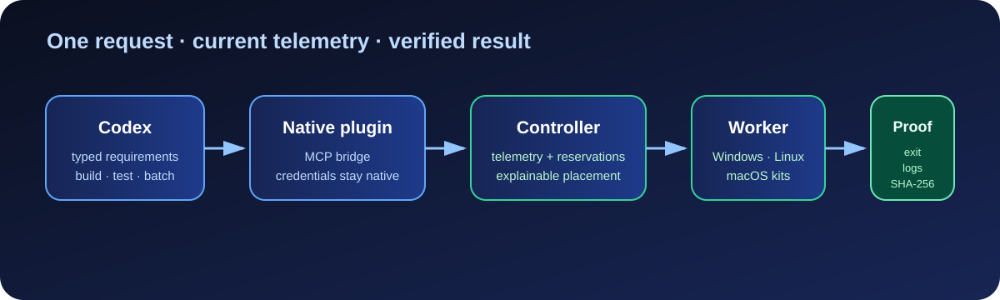
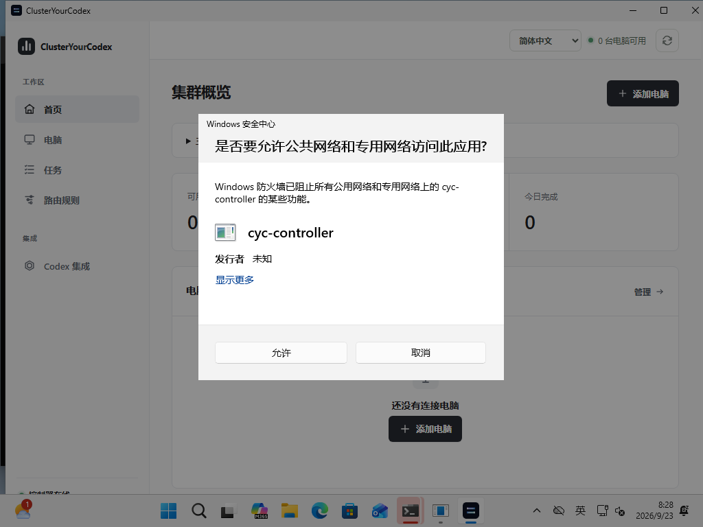
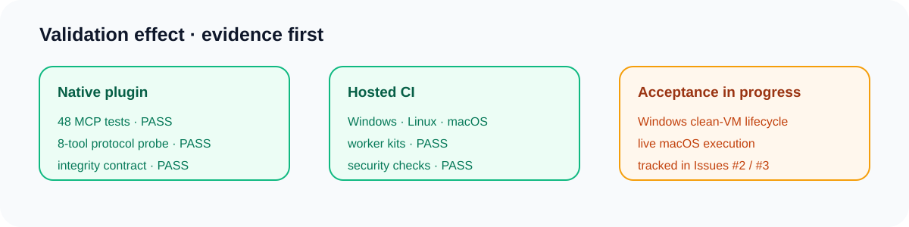

# ClusterYourCodex

> **Give Codex more computers.**

ClusterYourCodex is a Codex-first controller and worker fleet for computers you
own. It places build, test, batch, container, and GPU work on a compatible
worker, then returns native exit status, logs, cleanup state, and artifact
hashes to the Codex session.

   

## Current public status

The latest public developer build is **[v0.1.0-preview.111](https://github.com/TypeThe0ry/ClusterYourCodex/releases/tag/v0.1.0-preview.111)**. It carries the Windows profile-matrix queue/recovery hardening, a bounded native Task Scheduler COM query, phase-timestamp diagnostics, and a passing clean Windows 11 ARM64 x64-emulation acceptance job. Preview.110 remains an immutable, unpublished candidate because its fail-closed tagged workflow ran before exact-source CI completed. Preview.111 remains a prerelease while the native acceptance gates are incomplete. The immutable stable baseline is **[v0.0.1](https://github.com/TypeThe0ry/ClusterYourCodex/releases/tag/v0.0.1)**; it has not been replaced or modified.

| Area | Status |
| --- | --- |
| Windows x64 desktop/controller | Public preview; install, repair, plugin registration, health, and controller/worker checks are available. |
| Linux x64 worker | Public Worker Kit and Windows → Linux validation path. |
| macOS x64 / arm64 worker packages | Worker Kits build and verify; native managed-runtime acceptance is deferred in [Issue #3](https://github.com/TypeThe0ry/ClusterYourCodex/issues/3). |
| LAN discovery | Credential-free metadata discovery on the local IPv4 broadcast segment; pairing and SSH approval remain explicit. |
| Live three-machine deployment | Preview.111 is running on this Windows controller, the NUC Linux worker, and the Helio Windows worker; see the [deployment record](docs/live-deployment-preview111-20261004.md). |
| Stable GA | Not yet declared. [Issue #2](https://github.com/TypeThe0ry/ClusterYourCodex/issues/2) and [Issue #3](https://github.com/TypeThe0ry/ClusterYourCodex/issues/3) track the remaining native gates. |

For the authoritative commit, workflow runs, VM evidence, and open gates, see
the [current audit](docs/current-audit-20261004.md), the [preview.111 VMware record](docs/vmware-preview111-20261004.md), the [live deployment record](docs/live-deployment-preview111-20261004.md), and [project status](docs/project-status.md).

## Install the public Windows build

1. Download Windows Setup for the latest published preview from the [releases page](https://github.com/TypeThe0ry/ClusterYourCodex/releases) and its matching `.sha256` sidecar.
2. Verify the download before running it:

   ~~~powershell
   $setup = Resolve-Path .\ClusterYourCodex-Setup.exe
   $actual = (Get-FileHash -Algorithm SHA256 $setup).Hash.ToLowerInvariant()
   $expected = ((Get-Content "$setup.sha256" -Raw).Trim() -split '\s+')[0].ToLowerInvariant()
   if ($actual -cne $expected) { throw 'SHA-256 mismatch' }
   ~~~

3. Run Setup. Per-user files are installed under
   %LOCALAPPDATA%\Programs\ClusterYourCodex; the desktop and native Codex
   plugin are registered together.
4. Open **Add Computer**. Use **Scan local network** to prefill a running CYC
   controller, or enter a worker host manually. Confirm the SSH host-key
   fingerprint, then install, pair, start, and probe the worker.
5. Run **Advanced verification → Full Run Check**, then ask Codex to execute a
   real build or test.

The installer is currently code-unsigned. Keep the sidecar beside Setup and
verify it before launch. The supported execution boundary is a trusted,
single-user workload; hostile multi-tenant isolation is outside this release.

## What the UI does

The desktop keeps the main path short:

- **Add Computer** discovers or registers a worker, checks reachability, and
  guides SSH installation and explicit pairing.
- **Run Check** reports health, plugin state, worker capabilities, and a real
  controller-to-worker probe.
- The activity view shows placement, queue/running/succeeded state, logs,
  cleanup, and artifact verification for each run.

The screenshot shows the first-run Windows firewall prompt and the empty-fleet
home screen. It demonstrates the desktop rendering and first launch only; it is
not proof of remote-worker connectivity. The validation diagram below is a
summary of recorded checks, not a live dashboard.

## LAN discovery and credentials

**Scan local network** sends a credential-free UDP discovery probe on the local
IPv4 layer-2 segment (UDP 47830). It returns metadata such as address, role,
version, and pairing readiness. It does not enumerate routed subnets, transmit
an SSH password, or pair a machine automatically.

Host-key approval, SSH credentials, worker installation, and pairing are still
explicit steps. Passwords, private keys, and bearer tokens stay behind native
vault/config references and never enter JobSpec, MCP payloads, logs, or Codex
messages. Windows may remember a password in Credential Manager; other
controllers use an explicit session-only path when no persistent native vault
is available.

See the [cross-platform validation and discovery record](docs/cross-platform-validation-20260927.md)
and the [SSH onboarding harness](docs/provisioning-ssh-e2e-20261001.md).

## Native Codex plugin recovery

If Codex reports **“The installed Codex payload or its build catalog failed
integrity verification”** or **“built-in Codex plugin payload is missing or
incomplete”**, repair the native payload from a source checkout. This is a
build-tool path, not a dependency-free Setup shortcut:

~~~powershell
$marketplace = Join-Path $env:USERPROFILE '.codex/marketplaces/clusteryourcodex'
powershell -ExecutionPolicy Bypass -File scripts/Install-NativeCodexPlugin.ps1 -MarketplaceRoot $marketplace -Repair
~~~

The script backs up an interrupted or partial marketplace, rebuilds the
payload, verifies the manifest and hashes, probes the bundled MCP runtime, and
registers the native plugin. It removes exact-name legacy clustor,
cluster-orchestrator, and orchestrator skill directories into a recoverable
timestamped backup; it does not rely on those skills.

Verify the contract and cached payload with:

~~~powershell
powershell -ExecutionPolicy Bypass -File scripts/Test-NativeCodexPluginContract.ps1
$pluginRoot = Join-Path $env:LOCALAPPDATA 'Programs/ClusterYourCodex/integrations/codex-marketplace/plugins/cluster-your-codex'
powershell -ExecutionPolicy Bypass -File scripts/Test-NativeCodexPlugin.ps1 -PluginRoot $pluginRoot
pnpm --filter @clusteryourcodex/codex-mcp test -- --run
~~~

The [plugin recovery record](docs/native-plugin-recovery-20260918.md) and
[cache verification record](docs/native-plugin-cache-verification-20260919.md)
contain the detailed probes and expected boundaries. A failed integrity check
should be repaired, not bypassed.

## How work is placed

~~~text
Codex session
    -> native ClusterYourCodex plugin + MCP bridge
    -> local Controller (requirements, telemetry, reservations)
    -> Windows / Linux / macOS Worker
    -> exit status + logs + SHA-256 artifact evidence
~~~

The Controller chooses a compatible worker from current capabilities, load, and
reservations. The model supplies requirements and consumes verified results; it
does not choose a worker from a stale snapshot and never receives worker
credentials.

The repository is organized around cyc-controller (API, persistence,
scheduling, and lifecycle), cyc-worker (inventory, pairing, execution),
cyc-cli (diagnostics), cyc-protocol (portable contracts), cyc-scheduler
(explainable placement), apps/desktop, and the native
plugins/cluster-your-codex package.

## Validation boundaries

Hosted CI covers Rust on Windows/Linux/macOS, Worker Kit packaging, security
checks, the desktop bridge, and Windows controller/worker fixtures. D-drive
VMware evidence covers Windows Setup, health, repair, uninstall, discovery, and
same-host live round trips. Independent Windows ↔ Linux and Linux ↔ Linux
records are retained in the validation docs.

These checks do not yet close every GA gate. The current Windows gap is a
single clean-guest current-source matrix covering Install → Repair → versioned
Upgrade → interrupted Rollback → Uninstall, plus an independent guest worker
and remaining production signing/tray requirements. The macOS gap is native
LaunchAgent lifecycle, live controller/worker execution, and detached-process
cleanup. The detailed evidence and exact status belong in [Issue #2](https://github.com/TypeThe0ry/ClusterYourCodex/issues/2), [Issue #3](https://github.com/TypeThe0ry/ClusterYourCodex/issues/3), and the [current audit](docs/current-audit-20261004.md).

## Develop

~~~powershell
git clone https://github.com/TypeThe0ry/ClusterYourCodex.git
cd ClusterYourCodex
pnpm install --frozen-lockfile
cargo fmt --all -- --check
cargo test --workspace
pnpm -r lint
pnpm -r test
pnpm -r build
~~~

Use pnpm dev for the browser renderer. For the native desktop, use
pnpm --filter @clusteryourcodex/desktop tauri:dev with Rust and the Tauri
Windows prerequisites installed. Packaging, acceptance, and release rules are
in [docs/packaging.md](docs/packaging.md) and [docs/release-process.md](docs/release-process.md).

## Documentation map

- [Windows getting started](docs/getting-started-windows.md)
- [Add a Windows computer](docs/add-windows-computer.md)
- [Add a Linux computer](docs/add-linux-computer.md)
- [Codex integration](docs/codex-integration.md)
- [Upgrade, repair, rollback, uninstall](docs/upgrade-rollback.md)
- [Compatibility and security boundary](docs/compatibility.md)
- [Troubleshooting](docs/troubleshooting.md)
- [Cross-platform validation and LAN discovery](docs/cross-platform-validation-20260927.md)
- [Current audit](docs/current-audit-20261004.md)
- [Live preview.111 deployment](docs/live-deployment-preview111-20261004.md)
- [Project status](docs/project-status.md)
- [Changelog](CHANGELOG.md)
- [Contributing](CONTRIBUTING.md)

## Product boundary and license

ClusterYourCodex distributes executable work initiated by Codex. It is not a
remote desktop, generic cluster administrator, or hostile-code sandbox. See
[ADR 0001](docs/adr/0001-product-boundary.md) for the product boundary and
[LICENSE](LICENSE) for licensing terms.
